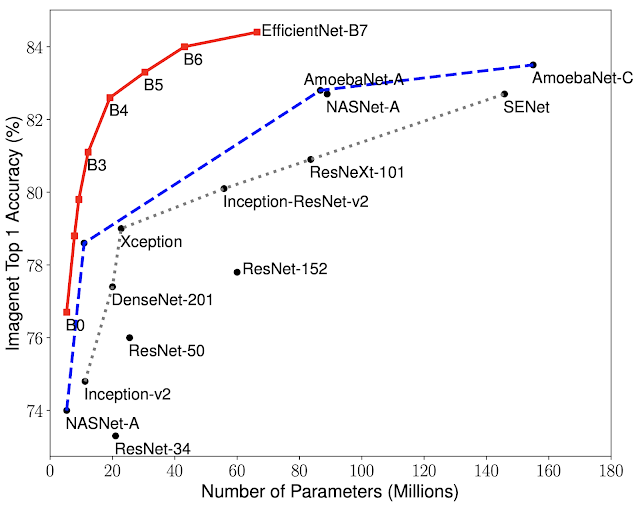

July 2020
# Modified Efficientnet for Age and Gender Prediction

Profiling people from images will enable malls, shops, etc. to generate better insight from their video stream data. This project modifies an EfficientNet B4 to create a multi-headed CNN that can predict the age and gender from a person's face.

Refer to this README for a quick summary of the implementation, or view the notebooks for an in-depth description. The data and some data-cleaning steps are not included in this repo, as the data is open-source and the steps are straightforward. This repo focuses on the techniques used in developing this model.

Below are the out-of-sample test results:
```
Test Sample Count: 1041
Age Mean Average Error (Standard Deviation): 4.8 (4.3)
Gender Accuracy: 96.8%
```
## EfficientNet Background

In 2020, the EfficientNet was the state-of-the-art CNN architecture for image classification. Its 8 versions, each of different size, boasts significantly higher accuracies over similarly sized models.



## Model Overview

An EfficientNet B4 is modified to produce a double-headed model, with one a regressor (age) and the other a classifier (gender). It is pre-loaded with ImageNet weights and fine tuned with the 100,000+ face samples.

## Data & Preprocessing

Data was taken from the Wikipedia (https://data.vision.ee.ethz.ch/cvl/rrothe/imdb-wiki/, >50,000), AFAD Face (https://afad-dataset.github.io/, >50,000), and UTKFace (https://susanqq.github.io/UTKFace/, >20,000) Datasets. They generally consist of faces of people ages 0 to 80 with age and gender labels.


This project is an implementation of Efficientnet to build a multi-ouput model that can predict the age and gender of the person. It is trained on the IMDB-Wiki dataset (https://data.vision.ee.ethz.ch/cvl/rrothe/imdb-wiki/) and the AFAD face dataset (https://afad-dataset.github.io/).

The model managed a test gender accuracy of above 95% and a test age MAE of around 5.

In depth project descriptions are in the notebooks
